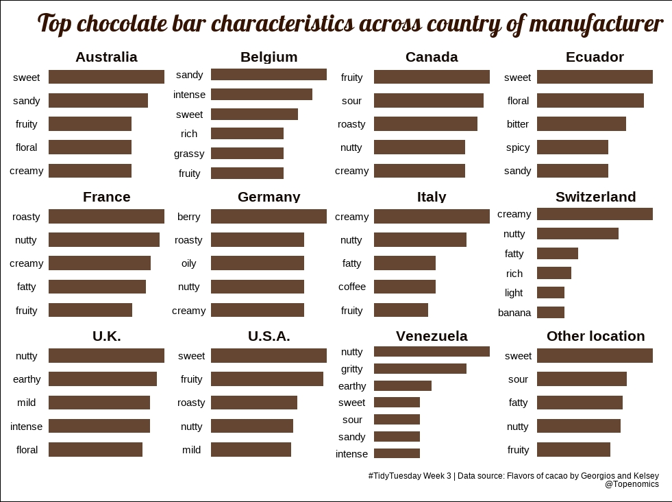

 

## Some of the TidyTuesday entries I like:

### Author: [elartedeldato](https://github.com/elartedeldato) | Code: [Link](https://github.com/elartedeldato/TidyTuesday/blob/main/R/2022_3_Chocolate.R) 

### Author: [loreabad6](https://github.com/loreabad6) | Code: [Link](https://github.com/loreabad6/TidyTuesday/blob/master/R/2022/week_03.Rmd)

### Author: [BjnNowak](https://github.com/BjnNowak) | Code: [Link](https://github.com/BjnNowak/TidyTuesday/blob/main/SC_CocoaBeans.R)

### Author: [lau-cloud](https://github.com/lau-cloud) | Code: [Link](https://github.com/lau-cloud/TidyTuesdaycode/blob/master/follow_the_cacao/scipt.R)

