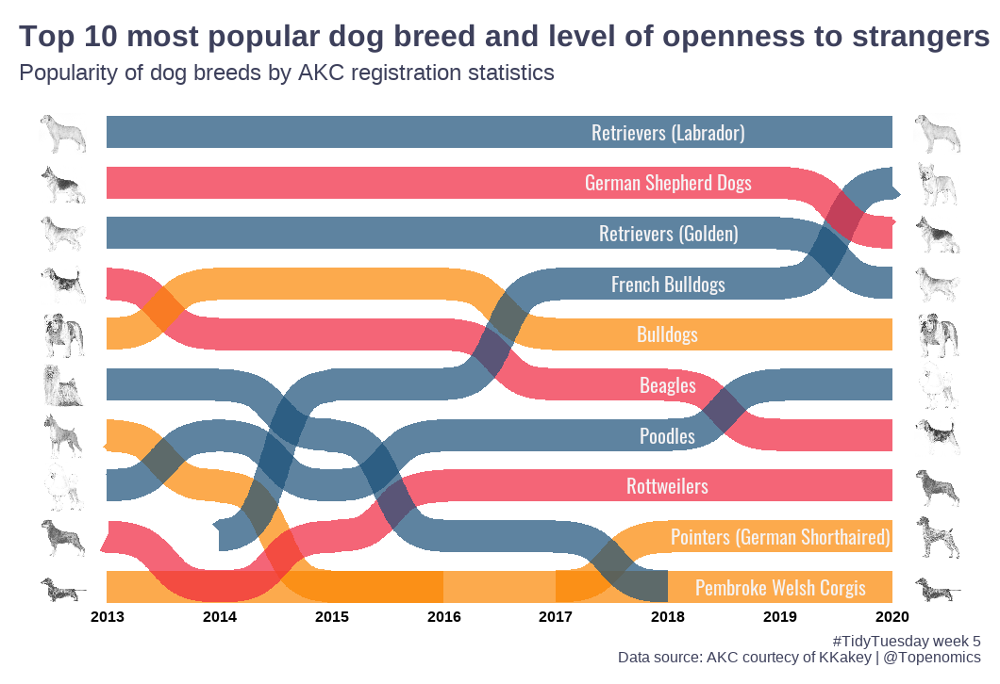

## Week 5

In TidyTuesday Week 5, I adapted the code from [leeolney3](https://github.com/leeolney3).

 

***

# Some of the TidyTuesday entries:

### Author: [leeolney3](https://github.com/leeolney3) | Code: [Link](https://github.com/leeolney3/TidyTuesday/blob/main/2022/week_05/2022_05.R) 

### Author: [BjnNowak](https://github.com/BjnNowak) | Code: [Link](https://github.com/BjnNowak/TidyTuesday/blob/main/SC_Dogs.R) 

### Author: [BlakeRMills](https://github.com/BlakeRMills) | Code: [Link](https://github.com/BlakeRMills/TidyTuesday/blob/main/2022/Dog%20Breeds%20(1%20Feb%202022)/Dogs%20(1%20Feb%202022).R) 

### Author: [tashapiro](https://github.com/tashapiro) | Code: [Link](https://github.com/tashapiro/TidyTuesday/blob/master/2022/W5/dog-breeds.R) 

